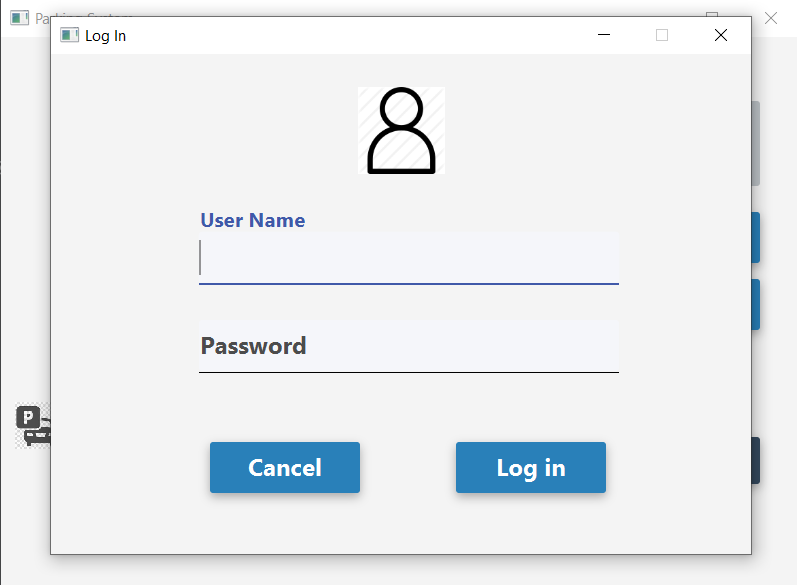
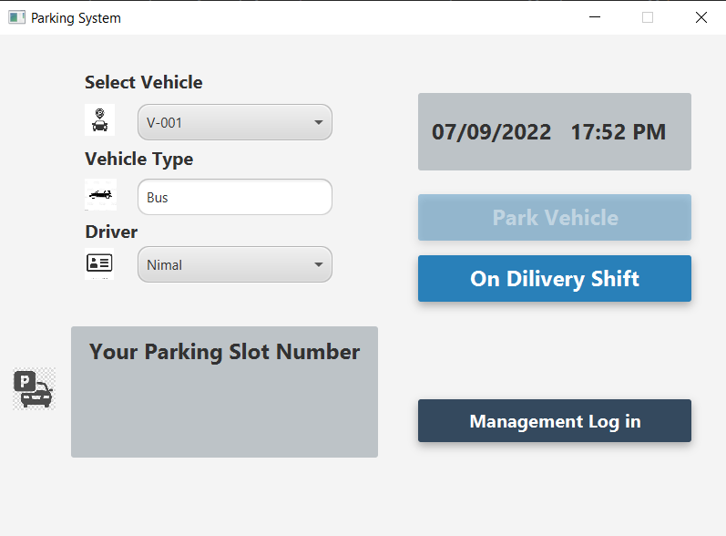
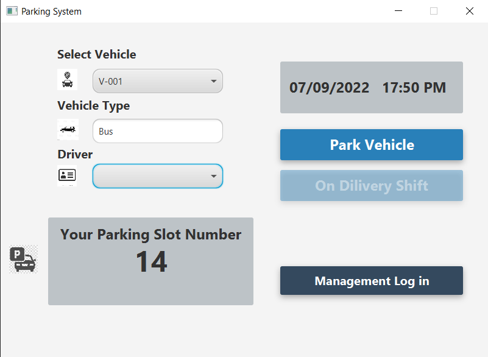
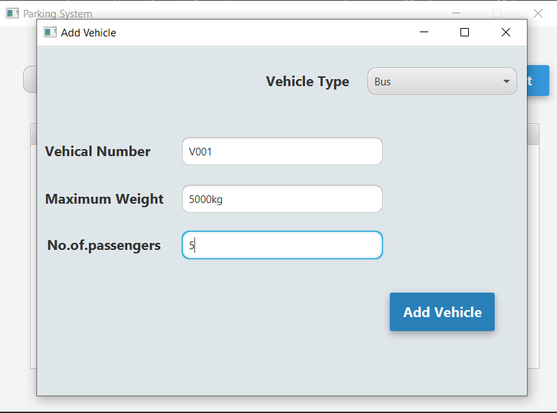
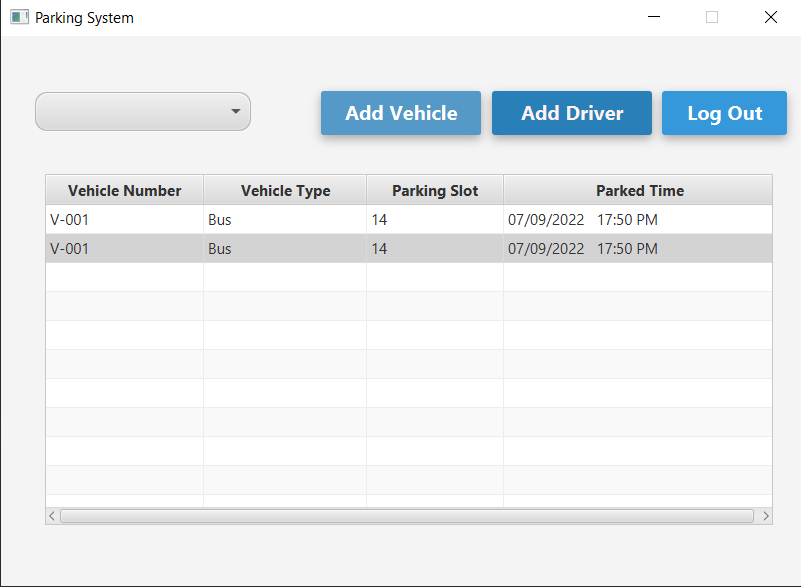

#Vehicle Parking System 

This project is done by using MVC Architecture for OOP Module

*MVC Architecture 
*Java 
*javaFx 

<b>#Login </b>
 
<b>#Delivery DashBoard <b>
 
<b>#Parking DashBoard <b>
 
<b>#Add Vehicle <b>
 
<b>#Add Driver <b>
 
<b>#Manage </b>

